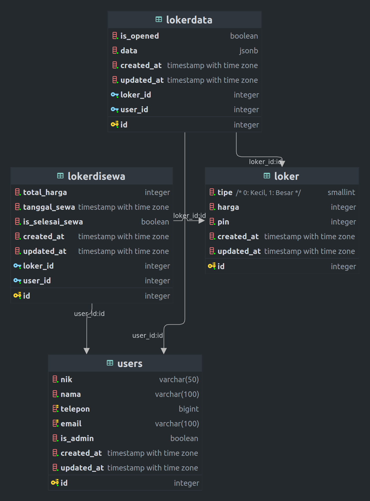
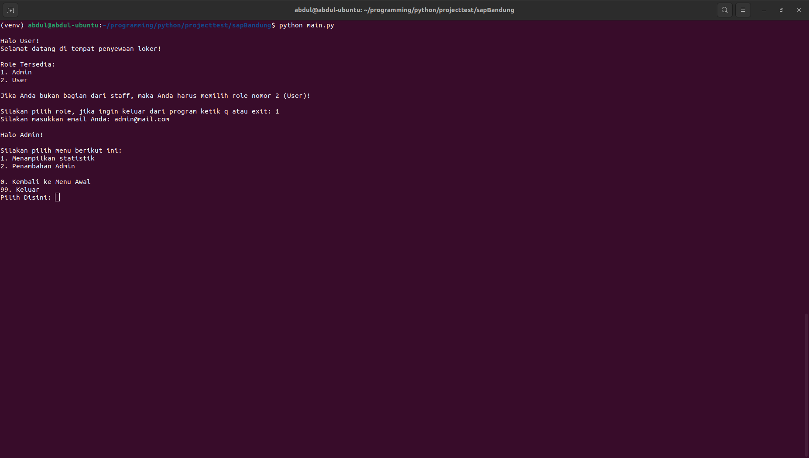
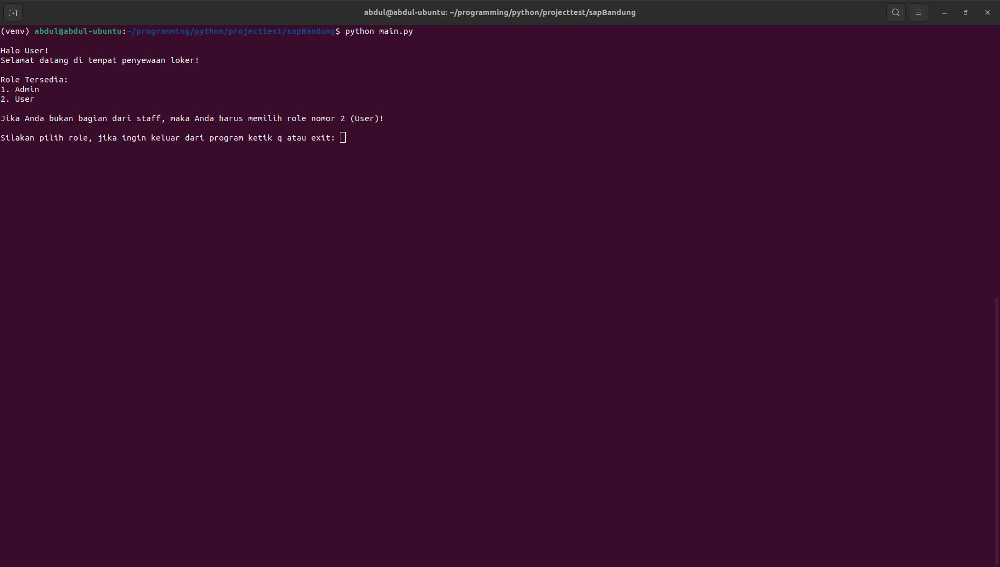

# Digital Locker

## Pendahuluan

Digital Locker ini dibuat untuk melengkapi tugas interview di SAP Bandung, pada 24 Oktober 2022.  
Aplikasi ini memiliki beberapa fungsi, di antaranya:
- Mendapatkan laporan ketersediaan loker
- Melaporkan Loker yang tersedia
- Penambahan User
- Penambahan Data Loker berdasarkan user
- Terdapat pin pada loker

Aplikasi ini menggunakan Postgres SQL sebagai database nya

## Database Model
ERD pada database tersebut sudah ada pada foto loker_erd.png

## System Requirement
- Python 3.8 atau lebih tinggi
- Postgres SQL

## Cara Penggunaan
1. Clone repository ini
2. Masuk ke folder repository tersebut
3. Jalankan perintah `python3 -m venv venv` untuk membuat virtual environment
4. Jalankan perintah `. venv/bin/activate` atau `venv/Scripts/activate` (untuk windows) untuk mengaktifkan virtual environment
5. Jalankan perintah `pip install -Ur requirements.txt`
6. Ubah database url yang tertera pada file main.py line 9
7. Jalankan perintah `python main.py`

## Screenshot

